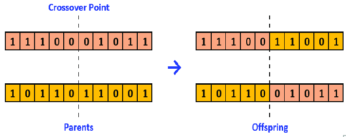

```{r setup, include=FALSE} 
knitr::opts_chunk$set(warning = FALSE, message = FALSE)
```

## Introduction

Making relevant groups of students, for doing some practical exercises for
example, or in
[problem-based learning](https://teaching.cornell.edu/teaching-resources/engaging-students/problem-based-learning), 
is one common problem for teachers.
Groups must not be too small, or too large, and the mean "level" of each group
should be as homogeneous as possible.
We don't want one group with only students in difficulty and one group with only 
"good grades" students.
In addition, students in each group should get along with each other,
and all participate in solving the exercises.

Generally, we just let the students make their own groups with some size
limitations, or we just do random groups.

Obviously, it's quite sub-optimal.

A possible way should be to use a metric (grades, IQ, etc.) to evaluate
students and make groups according to this metric.
To illustrate this post, I decided to use the
["Reading the Mind in the Eyes" Test (RMET)](https://link.springer.com/referenceworkentry/10.1007/978-3-319-28099-8_549-1).
This test aims to evaluate the "emotional"/"social" intelligence of
the subjects.
According to [Riedl *et al.* (2021)](https://www.pnas.org/doi/full/10.1073/pnas.2005737118),
a high social perceptiveness of group members is quite correlated to
a high collective intelligence.
So, why not use RMET as a base to construct groups of students?

Let's first generate some random RMET scores to represent our students.
In my case, I'm teaching 18-25 years old students at university.
According to
[Kynast *et al.* (2021)](https://www.frontiersin.org/articles/10.3389/fnagi.2020.607107/full),
the mean RMET score for this age range is 26
(with a standard deviation of 3.2).

```{r students}
# set seed to reproduce results
seed <- 42
set.seed(seed)

# generate random RMET scores for each student
nbStudents <- 20
students <- data.frame(
    id=1:nbStudents, 
    rmet=round(rnorm(nbStudents, mean=26, sd=3.2))
  )
knitr::kable(students, "pipe")
```

Now, we want to distribute these students into several groups in the
most homogeneous way possible, with a minimum and a maximum number of students
in each group.

```{r setupMinMax}
minStudentsByGroup <- 3
maxStudentsByGroup <- 6
```

Based on these minimum and maximum numbers of students by group, we can
easily know the minimum and maximum numbers of groups we can hypothetically
create.

```{r nbgroups, results = 'asis'}
# we round to the nearest value up with ceiling function
# because if nbStudents %% maxStudentsByGroup != 0, we need an additionnal group
nbGroupsMin <- ceiling(nbStudents / maxStudentsByGroup)
cat("    ", nbGroupsMin, "\n")

# we don’t care of nbStudents %% minStudentsByGroup in this case
# because groups are not full
nbGroupsMax <- nbStudents %/% minStudentsByGroup
cat("    ", nbGroupsMax)
```

This problem can be seen as a variation of the
[knapsack problem](https://en.wikipedia.org/wiki/Knapsack_problem).
However, instead of choosing which item to put in a unique bag,
we want to take all the items and distribute them as homogeneously
as possible into several bags.
The knapsack problem is an
[NP-hard problem](https://en.wikipedia.org/wiki/NP-hardness).
We can then suppose that our variation of this problem is also
NP-hard.
Testing all the possible solutions is then not an option, it's too
time-consuming.

A possible way is to use a
[metaheuristic algorithm](https://www.sciencedirect.com/science/article/pii/B9780128133149000104).
Meta-heuristic algorithms compose a subclass of algorithms
dedicated to exploring the scope of possible solutions for
a specific problem. They are based on
[heuristics](https://en.wikipedia.org/wiki/Heuristic)
on how to explore solutions to problems in general, 
and not on heuristics to solve a specific problem.
That’s why they are called "meta-heuristic" algorithms.

One of these meta-heuristic algorithms is the Genetic Algorithm.
It's a [bio-inspired algorithm](https://www.researchgate.net/profile/Hassan-Chizari/publication/341594685_Review_and_Classification_of_Bio-inspired_Algorithms_and_Their_Applications/links/61504a12d2ebba7be74b8163/Review-and-Classification-of-Bio-inspired-Algorithms-and-Their-Applications.pdf)
inspired by the
[theory of evolution](https://en.wikipedia.org/wiki/Evolution)
(AKA: the most adapted to its environment will survive).
The genetic algorithm emulates the process of species selection
to explore solutions to a problem,
its main "meta-heuristic" being: it works for species
to find relevant adaptations to their environments, so why not
for algorithms to find relevant solutions to a problem?

The genetic algorithm, as we'll see in this blog post, is quite adapted
to explore solutions to problems for which we have several parameters,
we can evaluate an output score, and for which we want
to know the combinations of parameters that maximize
(or minimize) the output score.

In our use case, we have several ways to group students (parameters) and
we want to find the most homogeneous one (output score).
Therefore, using a genetic algorithm seems quite adapted.
It is also the occasion to test, and explain step by step, 
a genetic algorithm with a practical use case.

## Naively apply basic genetic algorithm

To apply a basic genetic algorithm to our problem, we need to define two things:

* parameters that describe our problem, also called "solutions"
* our output score to evaluate a solution, also called "fitness"

The genetic algorithm will then explore possible solutions, evaluated their
fitness, and try to find the most optimized solutions.

### Representing our solutions

First, let's define how to represent possible solutions to our problem.
In the case of a binary genetic algorithm, this means that each parameter can
only be set at 0 or 1. A solution to our problem can be seen as a matrix.
Each row corresponds to a group and each column corresponds to a student.
If a student is affected to a group, the corresponding cell is set at 1.
Else, the cell is set at 0.

```{r example}
example <- c(
  1, 1, 1, 1, 0, 0, 0, 0, 0, 0, 0, 0, 0, 0, 0, 0, 0, 0, 0, 0,
  0, 0, 0, 0, 1, 1, 1, 1, 0, 0, 0, 0, 0, 0, 0, 0, 0, 0, 0, 0,
  0, 0, 0, 0, 0, 0, 0, 0, 1, 1, 1, 1, 0, 0, 0, 0, 0, 0, 0, 0,
  0, 0, 0, 0, 0, 0, 0, 0, 0, 0, 0, 0, 1, 1, 1, 1, 0, 0, 0, 0,
  0, 0, 0, 0, 0, 0, 0, 0, 0, 0, 0, 0, 0, 0, 0, 0, 1, 1, 1, 1,
  0, 0, 0, 0, 0, 0, 0, 0, 0, 0, 0, 0, 0, 0, 0, 0, 0, 0, 0, 0
)
knitr::kable(matrix(example, ncol=nbStudents, byrow=TRUE), "pipe")
```

However, the genetic algorithm we'll use doesn't use matrices to describe
solutions but lists. So, we'll have to switch from matrices to lists and from
lists to matrices when necessary.

Besides, there are other ways to represent our solutions. I'll talk about it at
the end of this post and explain why I preferred to use this representation.

### Defining the score of a solution

Now, let's define our fitness function that will evaluate the score of each
solution explored by the genetic algorithm.

First, we want that a solution describes valid groups: each student is
associated to only one group, no group is below the minimum number of students,
and no group is above the maximum number of students.
These are our "veto" conditions. If a solution doesn't respect these conditions
the score is set a 0.

This can be evaluated as follow.

```{r veto-example, results = 'asis'}
# convert solution to matrix
m <- matrix(example, ncol=nbStudents, byrow=TRUE)

# get number of groups by student
nbGroupsByStudent <- colSums(m)

# get number of students by group
nbStudentsByGroup <- rowSums(m)

# remove groups with zero student
nbStudentsByGroup <- nbStudentsByGroup[nbStudentsByGroup != 0]

if(any(nbGroupsByStudent != 1) # If any student is associated to zero or several groups
   || any(nbStudentsByGroup < minStudentsByGroup) # or if any group is too small
   || any(nbStudentsByGroup > maxStudentsByGroup)){ # or if any group is too big
  cat("    solution not valid")
} else {
  cat("    solution valid")
}
```

Once we have tested whether a solution is valid, we want to evaluate its score.

In our case, we want that the RMET mean score of each group is as similar to
each other.
This way, no group will have an unfair advantage over the other groups.
We don’t want that the distribution of groups' RMET mean scores
to be similar to the 
[current global wealth distribution](https://inequality.org/facts/global-inequality/).

So, first, let’s compute the RMET mean score of each group.

```{r rmetmean-example, results = 'asis'}
# to keep RMET means in memory
means <- c()

# for each possible group
for(i in 1:nbGroupsMax){
  
  # get the row corresponding to the group
  studentsInGroup <- m[i, ]
  
  # get the students' RMET of this group
  rmets <- students[studentsInGroup==1,]$rmet
  
  # if group not empty
  if(length(rmets) > 0){

    # compute the RMET mean of this group
    mean_rmet <- mean(rmets)
    cat("    Group", i, ":",  mean_rmet,"\n")

    # and keep it in memory
    means[length(means)+1] <- mean_rmet
  
  }

}

# compute score as the "macro" mean of RMET means
score <- mean(means)
cat("    Macro RMET mean :", score)
```

As we can observe in our example, if we only focus on mean RMET scores, we could
obtain solutions with one group (group 3) with an unfair advantage over the
other.
Mathematically speaking, computing the mean of RMET means in our case
will always give us the same result.
So it’s quite useless to compute it, and even more, to try to maximize it.

To obtain RMET scores homogeneously dispatched among groups, it’s the
standard deviation between RMET mean of each group that we want to minimize.
However, we’ll keep computing the "macro" mean of RMET means by group, 
for the skeptical ones, and we’ll subtract the standard deviation of RMET means
from this "macro" mean.
This is generally called a "penalty".
This way, we have a maximum threshold to reach ("macro" RMET mean score) and the
genetic algorithm will search for solutions with a fitness score the closest
to this threshold.

(It’s also because I found it more satisfying to see a fitness growing than
reducing, it’s more "visual", you’ll see).

```{r penaltyexample, results = 'asis'}
penalty <- sd(means)
cat("    Fitness =", score,"-",penalty,"=", score - penalty)
```

Now, we have all the elements to define our fitness function and test it
on our example.

```{r fitnessFunc, results = 'asis'}
fitness=function(solution)
{
  m <- matrix(solution, ncol=nbStudents, byrow=TRUE)

  nbGroupsByStudent <- colSums(m)
  nbStudentsByGroup <- rowSums(m)
  nbStudentsByGroup <- nbStudentsByGroup[nbStudentsByGroup != 0]
  
  if(any(nbGroupsByStudent != 1) 
     || any(nbStudentsByGroup < minStudentsByGroup) 
     || any(nbStudentsByGroup > maxStudentsByGroup))
    return(0)

  means <- c()
  for(i in 1:nbGroupsMax){
    studentsInGroup <- m[i, ]
    rmets <- students[studentsInGroup==1,]$rmet
    if(length(rmets) > 0){
      means[length(means)+1] <- mean(rmets)
    }
  }

  score <- mean(means)
  penalty <- sd(means)
  
  return(score - penalty)
}

cat("    ", fitness(example))
```

### Exploring solutions

Now we have defined our solutions and how to evaluate them, we can apply a
genetic algorithm to our problem.

To do so, we'll use the R package [*GA*](https://luca-scr.github.io/GA/)
proposed by
[Scrucca (2013)](https://www.jstatsoft.org/article/view/v053i04).

As input, the *ga* function needs to know:

* the type of genetic algorithm to apply ("binary", in our case)
* the number of parameters in a solution
  ($nbStudents \times nbGroupsMax$, in our case)
* the number of iterations (also called "generations")
* the number of solutions tested by iteration
* if we want to keep the best solution found in a generation N
  into the generation N+1 (a process called "Elitism")

The steps of a genetic algorithm are quite simple:

1. the first sample of solutions, the generation 0, is generated
2. the fitness of each solution is evaluated
3. two solutions are selected according to their fitness score, a step called
   "Selection"
4. these two solutions are mixed up together to generate two new solutions,
   a step called "cross-over"
5. step 3. and 4. are repeated until a new sample of solutions is generated
6. the process is repeated from step 2. until the desired number of iterations
   is reached

Let's then explore solutions to our problem with the genetic algorithm.

```{r test-fitnessFunc}
library(GA)

GA=ga(
  type='binary',
  fitness=fitness,
  nBits=nbStudents*nbGroupsMax,
  maxiter=1000,
  popSize=1000,
  seed=seed,
  keepBest=TRUE,
  monitor = FALSE
)

plot(GA, ylim=c(0, mean(students$rmet)))
```

Aaaaaand, it doesn't work.

Even with a high number of solutions and generations, naively applying a basic
genetic algorithm to our problem seems to not even be able to find valid
solutions.

### Why it doesn’t work?

There are two main reasons for this failure.
The first one is that the number of valid group combinations is largely lesser
than the number of combinations tested by a basic binary genetic algorithm.

For instance, the number of valid group combinations can be calculated as
follow.

$$
\sum_{G \in \mathcal{G}} \prod_{i=0}^{|G|} C_{nbStudents - \sum_{j=0}^{i-1}g_j}^{g_i}
$$

With $\mathcal{G}$ the set of all possible combinations of group sizes
$G \in \mathcal{G}$, such as $\sum_{i=0}^{i=|G|} g_i = nbStudents$.
For example, the combination of group size $\{5,5,5,5,0,0\}$
is in $\mathcal{G}$.

Let's compute the number of valid group combinations, and the intermediate
numbers of combinations, for our use case.

```{r nbComb, results = 'asis'}
library(gtools) # to use the 'combinations' function
library(collections) # to use the 'dict' structure

# To keep the combinations found for later
diffGroupSizesCombinations <- dict()
k <- 1 # to count the number of combinations found

# to define the different group size possible
diffGroupSize <- minStudentsByGroup:maxStudentsByGroup
totNbCombinations <- 0 # to count the total number of valid combinations

# for each number of group possible
for(i in nbGroupsMin:nbGroupsMax){
  
  # compute the combinations of i groups
  # from the different possible group sizes
  c <- combinations(
      n=length(diffGroupSize), 
      r=i,
      v = diffGroupSize,
      repeats.allowed = TRUE
    )
  
  # for each combination found
  for(j in 1:nrow(c)){
    cj <- c[j, ] # the combination
    
    # check if the sum of groups’ size
    # correspond to the number of students
    if(sum(cj) == nbStudents){
      cat("    Group sizes: ")
      cat(cj)
      
      # keep the combination for later
      diffGroupSizesCombinations$set(as.character(k), cj)
      k = k + 1
      
      # compute the number of combination of students
      # for configuration of group sizes cj 
      nbCombinations <- 1.0
      nbStudentsLeft <- nbStudents
      # for each group size in cj configuration
      for(groupSize in cj){ 
        # compute combinations of group size
        # from students not grouped yet
        cGroupSize <- combinations(n=nbStudentsLeft, r=groupSize)
        
        # multiply with number of combinations found for previous groups
        nbCombinations = nbCombinations * nrow(cGroupSize)
        
        # update number of student not grouped yet
        nbStudentsLeft = nbStudentsLeft - groupSize
      }
      cat(", Nb possible combinations: ", nbCombinations, "\n")
      
      # add number of combinations found for cj to the total
      totNbCombinations = totNbCombinations + nbCombinations
    }
  }
}

cat("    ", totNbCombinations)
```

Let's now compare this number of valid group combinations with
the number of combinations tested by the genetic algorithm:

$$
2^{nbStudents \times nbGroupsMax}
$$

```{r totNbComb, results='asis'}
cat("    ", 2^(nbStudents*nbGroupsMax), "\n")

cat("    ", totNbCombinations / 2^(nbStudents*nbGroupsMax))
```

We can observe that the number of valid group combinations is just a very small
fraction of all combinations tested by the genetic algorithm.
This means that the genetic algorithm only has a small chance to find a valid
group combination from random initial solutions.

In addition, and this is the second reason for this failure, the valid solutions
are not "next to each other".
It's very easy to go from a valid solution to a non-valid one.
By simply changing a 0 to a 1, we can add a student to two groups, or create a 
too-large group.
This means that, even with valid initial solutions, the modifications made by
the genetic algorithm to explore possible solutions have a small chance to find
another valid solution.

## Customizing a Genetic Algorithm

Fortunately, the different steps of a genetic algorithm are highly customizable.
We'll then customize these different steps to reduce the scope of solutions
tested by the genetic algorithm to only valid group combinations.

In the R package *GA*, we can customize the following steps:

* Initialization, to Generate an initial population with only valid solutions
* Selection, to select the best solutions for "reproduction"
  (We'll not customize this step. But, if you want to select
  [Pareto optimum](https://en.wikipedia.org/wiki/Pareto_efficiency)
  solutions based on several fitness metrics, this is the place)
* Cross-over, to mixup characteristics of two valid
  solutions to create two new valid solutions
* Mutation, to change a characteristic of a valid solution
  to obtain a new valid solution

### Initial population

First of all, we need the genetic algorithm to start with only valid solutions.
To do so, we'll use the following function, based on the valid combinations of
group sizes computed before.

To create a valid initial solution, this function will first choose one random
combination $G$ of group sizes (for example $\{5, 5, 5, 5, 0, 0\}$).
And then, for each group size $g \in G$, the function chooses $g$ students among
the students not grouped yet.

```{r popFunc}
group_population <- function(object){
  # init population with empty matrix
  population <- matrix(
      rep(0, object@nBits*object@popSize),
      ncol=object@nBits,
      nrow=object@popSize
    )
  
  # generate each individual of the population
  for(i in 1:object@popSize){
    # choose one possible combination of group size
    k <- sample(1:diffGroupSizesCombinations$size(), 1)
    groupSizes <- diffGroupSizesCombinations$get(as.character(k))
    
    # for each group
    studentsNotGroupedYet <- 1:nbStudents
    for(j in 1:length(groupSizes)){
      # choose n students from students not grouped yet
      studentIds <- sample(
          studentsNotGroupedYet,
          groupSizes[j]
        )
      
      # for each student selected
      for(id in studentIds){
        # set student to group j
        population[i, nbStudents * (j-1) + id] = 1
        # remove student from students not grouped yet
        studentsNotGroupedYet = studentsNotGroupedYet[studentsNotGroupedYet != id]
      }
    }
  }
  
  return(population)
}
```

Let's now test the genetic algorithm with this custom initialization function.

```{r test-popFunc}
GA=ga(
    type='binary',
    fitness=fitness,
    nBits=nbStudents*nbGroupsMax,
    population = group_population,
    maxiter=10,
    popSize=100,
    seed=seed,
    keepBest=TRUE,
    monitor = FALSE
  )

plot(GA, ylim=c(0, mean(students$rmet)))
```

We can observe that the first generation of solutions, the one generated with
our custom function, are valid solutions.
However, we can also see that the median score is zero.
This means that more than half of the solutions created from the initial
solutions are not valid.
It confirms our second assumption about why a basic binary genetic
algorithm failed to solve our problem.

### Cross-over best solutions

Now we have valid initial solutions, we need to find a way two combine the
characteristics of two "parents" valid solutions to generate two "children"
solutions which:

* are also valid solutions
* keep sub-characteristics of the two "parents" solutions

This step is called "cross-over" and it's inspired by
[chromosomes' cross-over](https://en.wikipedia.org/wiki/Chromosomal_crossover)
(even if, in biology, cross-over occurs between two chromosomes of the same
individual and not between two chromosomes of two distinct individuals).

We'll see that, in our case, it's a tricky step to customize.

Let's take an example of two valid solutions we’ll use as "parents".

```{r crossoverExample-step1, results='asis'}
ex_parent1 <- example
knitr::kable(matrix(ex_parent1, ncol=nbStudents, byrow=TRUE), "pipe")
cat("    ", fitness(ex_parent1), "\n")

ex_parent2 <- c(
  0, 0, 0, 0, 0, 0, 0, 0, 0, 0, 1, 0, 1, 0, 1, 0, 1, 0, 1, 0,
  0, 0, 0, 0, 0, 0, 0, 0, 0, 0, 0, 1, 0, 1, 0, 1, 0, 1, 0, 1,
  1, 0, 1, 0, 1, 0, 1, 0, 1, 0, 0, 0, 0, 0, 0, 0, 0, 0, 0, 0,
  0, 1, 0, 1, 0, 1, 0, 1, 0, 1, 0, 0, 0, 0, 0, 0, 0, 0, 0, 0,
  0, 0, 0, 0, 0, 0, 0, 0, 0, 0, 0, 0, 0, 0, 0, 0, 0, 0, 0, 0,
  0, 0, 0, 0, 0, 0, 0, 0, 0, 0, 0, 0, 0, 0, 0, 0, 0, 0, 0, 0
)
knitr::kable(matrix(ex_parent2, ncol=nbStudents, byrow=TRUE), "pipe")
cat("    ", fitness(ex_parent2))
```

In a basic binary genetic algorithm, as illustrated in the figure below proposed
by [Alamri and Alharbi (2020)](https://www.researchgate.net/publication/347003654_A_Framework_for_Optimum_Determination_of_LCL-Filter_Parameters_for_N-Level_Voltage_Source_Inverters_Using_Heuristic_Approach),
the "cross-over" function will generally
split the "parents" in two and generate the "children" with the four sub-parts.




Let's apply this process to our example.

```{r crossoverExample-step2, results='asis'}
split <- length(ex_parent1) %/% 2
ex_child1 <- append(ex_parent1[1:split], ex_parent2[(split+1):length(ex_parent1)])
knitr::kable(matrix(ex_child1, ncol=nbStudents, byrow=TRUE), "pipe")
cat("    ", fitness(ex_child1), "\n")

ex_child2 <- append(ex_parent2[1:split], ex_parent1[(split+1):length(ex_parent1)])
knitr::kable(matrix(ex_child2, ncol=nbStudents, byrow=TRUE), "pipe")
cat("    ", fitness(ex_child2))
```

We can observe that the generated "children" solutions, with this method,
are not valid at all.
This explains the direct decrease in fitness scores observed before.

To customize the cross-over function, we need to understand the
characteristics of a solution that we want "children" solutions to inherit
from their "parents" solutions.

In our use case, we have two main characteristics of a solution:

* the number of students by group
* the sets of students that are grouped together

To simplify the cross-over process, let's keep the number of students from
parents to children (children1 will have the same number of students in each
group than parent1, and so on for parent2).
This characteristic allows us to be sure to generate solutions with valid group
sizes.

```{r crossOverExample-step3}
# initialize child with a list of zero
ex_child1 <- rep(0, length(ex_parent1))

# get groups of students in parent1
groups <- matrix(ex_parent1, ncol = nbStudents, byrow = TRUE)

# compute the number of students by groups
nbStudentsByGroup <- rowSums(groups)
# remove empty groups
nbStudentsByGroup <- nbStudentsByGroup[nbStudentsByGroup != 0]
```

Concerning the sets of students grouped together, we can first observe that the
composition of the last group is implied by the other groups.
So we can focus on the composition of $nbGroups - 1$ groups.

To keep a sub-part of students grouped together in the first parent, we can
simply keep the composition of $(nbGroups - 1) / 2$ random groups from this
first parent.

```{r crossOverExample-step4}
# compute the number of groups will keep from parent 1
nbGroupKept <- (length(nbStudentsByGroup) - 1) %/% 2

# choose random groups in parent1 to keep in child
groupKeptIds <- sample(1:length(nbStudentsByGroup), nbGroupKept, replace = FALSE)

# to trace the groups not keept from parent1
groupIdsLeft <- 1:length(nbStudentsByGroup)

# to trace the students not grouped yet
studentIdsLeft <-1:nbStudents

# for each group choose in parent1
for(groupKeptId in groupKeptIds){
  # get the corresponding row
  groupKept <- groups[groupKeptId,]
  # get the students in the group
  studentIds <- which(groupKept == 1)
  # for each student
  for(studentId in studentIds){
    # set the corresponding cell at 1 in the child 
    ex_child1[nbStudents * (groupKeptId-1) + studentId] = 1
    # remove the student from the list of students not grouped yet
    studentIdsLeft = studentIdsLeft[studentIdsLeft != studentId]
  }
  # remove group from groups not completed yet
  groupIdsLeft = groupIdsLeft[groupIdsLeft != groupKeptId]
}

knitr::kable(matrix(ex_child1, ncol=nbStudents, byrow=TRUE), "pipe")
```

Then, and it’s the tricky part, we have to get some characteristics from parent
2.
To do so, we can search, for each group $g$ not completed yet, for a subset of
$|g|$ students that are grouped together in the second parent (or several
subsets of students grouped together in the second parent until obtaining
$|g|$ students).

```{r crossOverExample-step5}
groupsInParent2 <- matrix(ex_parent2, ncol = nbStudents, byrow = TRUE)
studentsByGroupsInParent2 <- rowSums(groupsInParent2)
nbGroupsInParent2 <- length(studentsByGroupsInParent2[studentsByGroupsInParent2 != 0])

# for the (nbStudents - 1) / 2 groups not completed yet
while(length(groupIdsLeft) > 1){
  # choose a group
  groupId <- sample(groupIdsLeft, 1)
  
  # get the size of the group in parent 1
  groupSize <- nbStudentsByGroup[groupId]

  # while the corresponding group in child is not completed
  while(groupSize > 0){
    # get a random group g2 in parent 2
    groupIdInParent2 <- sample(1:nbGroupsInParent2, 1)

  	# get the students in the group g2
    studentIds <- which(groupsInParent2[groupIdInParent2, ] == 1)

    # get the intersection between g2 and the students not grouped yet in the child
    studentSelectedIds <- intersect(studentIds, studentIdsLeft)

    # get a subset of this intersection if necessary
    if(length(studentSelectedIds) > groupSize)
      studentSelectedIds <- sample(studentSelectedIds, groupSize, replace = FALSE)
   
   # complete the child with students of the intersection	
    for(studentId in studentSelectedIds){
      ex_child1[nbStudents * (groupId-1) + studentId] = 1
      studentIdsLeft = studentIdsLeft[studentIdsLeft != studentId]
    }

    # to know if we need more students to complete the group
    groupSize = groupSize - length(studentSelectedIds)
  }
  groupIdsLeft = groupIdsLeft[groupIdsLeft != groupId]
}

knitr::kable(matrix(ex_child1, ncol=nbStudents, byrow=TRUE), "pipe")
```

Finally, now we have $nbGroups - 1$ completed, we just have to complete the last
group with students not grouped yet.

```{r crossOverExample-step6, results='asis'}
for(studentId in studentIdsLeft){
  groupId <- groupIdsLeft[1]
  ex_child1[nbStudents * (groupId-1) + studentId] = 1
}

knitr::kable(matrix(ex_child1, ncol=nbStudents, byrow=TRUE), "pipe")
cat("    ", fitness(ex_child1))
```

In this way, we keep the subsets of students grouped together in both "parents",
while keeping a valid number of students in each group.

This gives us the following function.

```{r crossoverFunc}
group_crossover = function(object, parents){
  # get parents
  parents <- object@population[parents,,drop = FALSE]
  # get number of paremeters in parents
  n <- ncol(parents) 
  
  # initialize children with matrice of zeros
  children <- matrix(rep(0, 2*n), nrow = 2, ncol = n)
  # initialize children fitness at NA
  # (this will force GA function to compute fitness for the children)
  childrenFitness <- rep(NA, 2)
  
  # for each children to generate
  for(i in 1:nrow(children)){

    ## STEP 1: get group sizes from parent 1 ##

    # get parent1
    parent1 <- parents[i,]
    # get groups of students in parent1
    groups <- matrix(parent1, ncol = nbStudents, byrow = TRUE)

    # compute the number of students by groups
    nbStudentsByGroup <- rowSums(groups)
    # remove empty groups
    nbStudentsByGroup <- nbStudentsByGroup[nbStudentsByGroup != 0]
    
    ## STEP 2: get groups structure from parent 1  ##

    # compute the number of groups will keep from parent 1
    nbGroupKept <- (length(nbStudentsByGroup) - 1) %/% 2

    # choose random groups in parent1 to keep in child
    groupKeptIds <- sample(1:length(nbStudentsByGroup), nbGroupKept, replace = FALSE)
    
    # to trace the groups not keept from parent1
    groupIdsLeft <- 1:length(nbStudentsByGroup)

    # to trace the students not grouped yet
    studentIdsLeft <-1:nbStudents
    
    # for each group choosen in parent1
    for(groupKeptId in groupKeptIds){
      # get the corresponding row
      groupKept <- groups[groupKeptId,]
      # get the students in the group
      studentIds <- which(groupKept == 1)
      # for each student
      for(studentId in studentIds){
	      # set the corresponding cell at 1 in the child 
        children[i, nbStudents * (groupKeptId-1) + studentId] = 1
        # remove the student from the list of students not grouped yet
	      studentIdsLeft = studentIdsLeft[studentIdsLeft != studentId]
      }
      # remove group from groups not completed yet
      groupIdsLeft = groupIdsLeft[groupIdsLeft != groupKeptId]
    }
    

    ## STEP 3: get groups structure from parent 2 ##

    # get parent 2
    parent2 <- if(i==1) parents[2,] else parents[1,]
    groupsInParent2 <- matrix(parent2, ncol = nbStudents, byrow = TRUE)
    studentsByGroupsInParent2 <- rowSums(groupsInParent2)
    nbGroupsInParent2 <- length(studentsByGroupsInParent2[studentsByGroupsInParent2 != 0])
    
    # for the (nbStudents - 1) / 2 groups not completed yet
    while(length(groupIdsLeft) > 1){
      # choose a group
      groupId <- sample(groupIdsLeft, 1)
      
      # get the size of the group in parent 1
      groupSize <- nbStudentsByGroup[groupId]

      # while the corresponding group in child is not completed
      while(groupSize > 0){
	      # get a random group g2 in parent 2
        groupIdInParent2 <- sample(1:nbGroupsInParent2, 1)

      	# get the students in the group g2
        studentIds <- which(groupsInParent2[groupIdInParent2, ] == 1)

	      # get the intersection between g2 and the students not grouped yet in the child
        studentSelectedIds <- intersect(studentIds, studentIdsLeft)

	      # get a subset of this intersection if necessary
        if(length(studentSelectedIds) > groupSize)
          studentSelectedIds <- sample(studentSelectedIds, groupSize, replace = FALSE)
       
       # complete the child with students of the intersection	
        for(studentId in studentSelectedIds){
          children[i, nbStudents * (groupId-1) + studentId] = 1
          studentIdsLeft = studentIdsLeft[studentIdsLeft != studentId]
        }

	      # to know if we need more students to complete the group
        groupSize = groupSize - length(studentSelectedIds)
      }
      groupIdsLeft = groupIdsLeft[groupIdsLeft != groupId]
    }
    
    ## STEP 4: complete last group with students not grouped yet  ##
    for(studentId in studentIdsLeft){
      groupId <- groupIdsLeft[1]
      children[i, nbStudents * (groupId-1) + studentId] = 1
    }
  }
  
  return(list(children=children, fitness=childrenFitness))
}

```

Let's try the genetic algorithm with this custom cross-over function, in
combination with our custom initialization function.

```{r test-coFunc}
GA=ga(
    type='binary',
    fitness=fitness,
    nBits=nbStudents*nbGroupsMax,
    population = group_population,
    crossover = group_crossover,
    maxiter=10,
    popSize=100,
    seed=seed,
    keepBest=TRUE,
    monitor=FALSE
  )

plot(GA, ylim=c(0, mean(students$rmet)))
```

We can observe that fitness scores do not directly decrease after the first
generation.
Moreover, the best solutions increase generation after generation.
However, the mean fitness score still decreases generation after generation.

This is due to the mutations (changing one parameter from 0 to 1, or from 1
to 0) of solutions generated by our cross-over function.
As introduced before, in our problem it's easy to obtain a non-valid solution
by simply changing one parameter.

### Mutate solutions

The last step we need to customize to apply the genetic algorithm to our problem
is the mutation step.

The idea of this step is to apply, once children are created, a little
modification to generate more diversity in the solutions tested.
Without mutation, there is a risk that the genetic algorithm stays on local
optimum solutions, even with the cross-over step.

In a basic genetic algorithm, a mutation consists to change the value of one
random parameter (from 0 to 1, or from 1 to 0).
However, applying this kind of mutation to a valid solution to our problem can
easily lead to a non-valid solution.
For example, it could set a student to two different groups or no group at all,
or simply create groups too small or too big.

In our case, the idea is simply to choose two random students from two
different groups and exchange them.

To do so, we'll use the following function.
It chooses two random groups, then one random student in each of these two
groups.
Then, it updates the solution to correspond to an exchange of the two selected
students.

```{r mutateFunction}
group_mutation <- function(object, solution){
  # get the solution to mutate
  mutate <- solution <- as.vector(object@population[solution,])
  
  # transform to matrices to get groups
  groups <- matrix(solution, ncol = nbStudents, byrow = TRUE)
  # remove empty groups (useless)
  groups <- groups[rowSums(groups) != 0, ]
  
  # sample two random groups
  selectedGroupIds <- sample(1:nrow(groups), 2, replace = FALSE)
  
  # select students to exchange
  group1 <- selectedGroupIds[1]
  student1 <- sample(which(groups[group1,] == 1), 1)
  group2 <- selectedGroupIds[2]
  student2 <- sample(which(groups[group2,] == 1), 1)
  
  # remove student from their groups
  mutate[nbStudents * (group1-1) + student1] = 0
  mutate[nbStudents * (group2-1) + student2] = 0
  
  # add them into the other groups
  mutate[nbStudents * (group1-1) + student2] = 1
  mutate[nbStudents * (group2-1) + student1] = 1
  
  return(mutate)
}
```

Let's test the genetic algorithm with this custom mutation function,
in combination with our initialization and cross-over functions.

```{r test-mutateFunction}
GA=ga(
  type='binary',
  fitness=fitness,
  nBits=nbStudents*nbGroupsMax,
  population = group_population,
  crossover = group_crossover,
  mutation = group_mutation,
  maxiter=300,
  popSize=100,
  seed=seed,
  keepBest=TRUE,
  monitor=FALSE 
)

plot(GA, ylim=c(0, mean(students$rmet)))
```

AAAND IT WORKS!

Moreover, if we summarize the results of the genetic algorithm, several
solutions have been found.

```{r bestsol, results='asis'}
summary(GA)
```

However, sets of 0 and 1 are difficult to analyze.

## Visualizing solutions

To better visualize the solutions, we can plot them as a graph/network of
students. To do so, we'll use the R package *igraph*.

```{r load-igraph}
library(igraph)
```

First, we need to represent the students with their RMET scores.
Each student are represented as nodes/vertices of the graph, with
their id and RMET score as labels.

```{r plot-students}
g <- make_empty_graph(directed = FALSE)

for(i in 1:nrow(students))
  g <- add_vertices(g, 1, label=paste(i, " (", students[i,]$rmet, ")", sep=""))


# plot graph
co <- layout_nicely(g)
plot(0, 
     type="n",
     ann=FALSE, axes=FALSE,
     xlim=extendrange(co[,1]), 
     ylim=extendrange(co[,2])
   )
plot(g, layout=co, rescale=FALSE, add=TRUE,
     vertex.shape="rectangle",
     vertex.size=strwidth(V(g)$label) * 100,
     vertex.size2=strheight(V(g)$label) * 100 * 1.5,
     edge.width=5
     )
```

Then, each edge of the graph will represent the fact that two students are in
the same group.

```{r plot-groups}
solution <- GA@solution[1,]
m <- matrix(solution, ncol = nbStudents, byrow = TRUE)

# for each group
for(i in 1:nbGroupsMax){
  # get the students in the group
  studentIds <- which(m[i, ] == 1)
  if(length(studentIds) > 0){ # group not empty
    edges <- c()
    # for each student if the group
    for(j in 1:length(studentIds)){
      edges[length(edges)+1] <- studentIds[j]
      if(j < length(studentIds)) # if not last student
	# connect students j and j+#
        edges[length(edges)+1] <- studentIds[j+1]
      else # if last student, connect it to the first
        edges[length(edges)+1] <- studentIds[1]
    }
    g <- add_edges(g, edges)
  }
}

# plot graph
co <- layout_nicely(g)
plot(0, 
     type="n",
     ann=FALSE, axes=FALSE,
     xlim=extendrange(co[,1]), 
     ylim=extendrange(co[,2])
   )
plot(g, layout=co, rescale=FALSE, add=TRUE,
     vertex.shape="rectangle",
     vertex.size=strwidth(V(g)$label) * 100,
     vertex.size2=strheight(V(g)$label) * 100 * 1.5,
     edge.width=5
     )

```

Now, it could be interesting to plot the RMET mean score of each group.
To do so, we compute the RMET mean and the center in the graph of each group.

```{r plot-rmet-means}
co <- layout_nicely(g)
plot(0, 
     type="n",
     ann=FALSE, axes=FALSE,
     xlim=extendrange(co[,1]), 
     ylim=extendrange(co[,2])
   )
plot(g, layout=co, rescale=FALSE, add=TRUE,
     vertex.shape="rectangle",
     vertex.size=strwidth(V(g)$label) * 100,
     vertex.size2=strheight(V(g)$label) * 100 * 1.5,
     edge.width=5
     )

rmet_means <- c()
for(i in 1:nbGroupsMax){
  studentIds <- which(m[i, ] == 1)
  if(length(studentIds) > 0){
    rmet_means[i] <- mean(students[m[i,]==1,]$rmet)
    studentCoors <- co[studentIds,]
    xcoor <- sum(studentCoors[,1]) / nrow(studentCoors)
    ycoor <- sum(studentCoors[,2]) / nrow(studentCoors)
    text(xcoor, ycoor, round(rmet_means[i], 1))
  }
}
```

Finally, we can aggregate all these elements in a function to plot any solution.

```{r displaygroup-function}
display_groupmaking <- function(solution){
  g <- make_empty_graph(directed = FALSE)

  for(i in 1:nrow(students))
    g <- add_vertices(g, 1, label=paste(i, " (", students[i,]$rmet, ")", sep=""), vertex.size=50)
  
  m <- matrix(solution, ncol = nbStudents, byrow = TRUE)
  rmet_means <- c()
  for(i in 1:nbGroupsMax){
    studentIds <- which(m[i, ] == 1)
    if(length(studentIds) > 0){
      rmet_means[i] <- mean(students[m[i,]==1,]$rmet)
      edges <- c()
      for(j in 1:length(studentIds)){
	edges[length(edges)+1] <- studentIds[j]
        if(j < length(studentIds))
          edges[length(edges)+1] <- studentIds[j+1]
        else
          edges[length(edges)+1] <- studentIds[1]
      }
      g <- add_edges(g, edges)
    }
  }
  
  # compute macro mean and standard deviation
  macro_rmet_mean <- mean(rmet_means)
  macro_rmet_sd <- sd(rmet_means)
  
  co <- layout_nicely(g)
  plot(0, 
       type="n",
       ann=TRUE, axes=FALSE,
       xlab="",
       ylab="",
       xlim=extendrange(co[,1]), 
       ylim=extendrange(co[,2]),
       main=paste("Score = ", macro_rmet_mean - macro_rmet_sd),
       sub=paste("Macro mean =", macro_rmet_mean, "±", macro_rmet_sd)
       )
  plot(g, layout=co, rescale=FALSE, add=TRUE,
       vertex.shape="rectangle",
       vertex.size=strwidth(V(g)$label) * 100,
       vertex.size2=strheight(V(g)$label) * 100 * 1.5,
       edge.width=5
       )
  
  
  ## add rmet’s mean for each group
  for(i in 1:nbGroupsMax){
    studentIds <- which(m[i, ] == 1)
    if(length(studentIds) > 0){
      studentCoors <- co[studentIds,]
      xcoor <- sum(studentCoors[,1]) / nrow(studentCoors)
      ycoor <- sum(studentCoors[,2]) / nrow(studentCoors)
      text(xcoor, ycoor, round(rmet_means[i], 1))
    }
  }
}
```

Now, we can visualize the different solutions found by our custom genetic
algorithm.

```{r displayBestSol}
for(i in 1:nrow(GA@solution)){
  display_groupmaking(GA@solution[i,])
}
```

We can observe that not all solutions have been found by the genetic algorithm.
Some students with the same RMET scores can be exchanged.
But, it's not a problem because it gives us a sample of good solutions to our
problem.
Moreover, we can exchange some students if necessary, without losing scores,
to find a configuration that satisfies everyone.

It could be interesting to use this visualization to observe the different
generations of solutions generated by the genetic algorithm. For example, it's
possible to define, with the *GA* package, a "monitor" function.
However, this blog post is already way too long, so maybe another time.

## Conclusion

I had multiple objectives with this blog post.
First, I wanted to practice genetic algorithms.
It's a type of algorithm I found very promising, especially
[genetic programming](https://www.sciencedirect.com/topics/medicine-and-dentistry/genetic-programming).
But, nowadays, I work almost entirely on machine learning and deep learning.

Secondly, I wanted to find a way to create homogeneous student groups.
As I say in the introduction, it's a common problem for teachers
I have sometimes to deal with, and there are no real optimal solutions.
In addition, it was possible to apply a genetic algorithm to
this problem, so it was the perfect occasion to test it.

Thirdly, I wanted to popularise how a genetic algorithms works with a practical
use case.
To do so, I tried to narrate the different steps I went through.
But, maybe, it would be more understandable with another use case.

Besides, I had to make some choices that could be not optimal.
For example, the choice of representing our problem as a binary problem
(I talk about that in the next section).
Also, for the cross-over step, I chose to keep the configuration of the parents'
group size.
This is not a "bad" choice.
It stays coherent with the idea to keep sub-characteristics of parents
in children. But, it mechanically decreases the diversity of group sizes in
solutions.
Generation after generation, the genetic algorithm converges to a certain
configuration of group sizes, with the possibility to explore other
configurations of group sizes.
It could be interesting to create mutation functions that
could divide large groups or merge small groups, in addition to the mutation
function which exchange two students.

More generally, as I said in the introduction, genetic algorithms are
quite interesting to find a set of parameters that
optimize the result of a fitness function.
For example, genetic algorithms are sometimes used 
in machine learning to find the best structures
of neural networks, with a method called [NEAT](https://towardsdatascience.com/neat-an-awesome-approach-to-neuroevolution-3eca5cc7930f)
(the number of neurons, the number of layers, etc. can be considered
as parameters to optimize).

Besides, genetic algorithms are also interesting to
find solutions to multi-objectives problems.
As I briefly said when I presented the customizable steps
of genetic algorithms, it's possible to have several
fitness scores to evaluate a solution and look
for Pareto optimal solutions at the selection phase.
It's more appropriate than trying to do some weighted average, which
is generally the worst thing to do. Especially if the different
objectives have nothing in common and cannot compensate
for each other.
Unfortunately, our use case didn’t need several objectives to be solved.
So, I didn't have the opportunity to try a multi-objectives genetic algorithm.
Maybe another time.

To conclude, I hope this blog post helped the few people
who read it to better understand genetic algorithms
and how to use/customize them.

### Bonus: another way to solve our problem with the Genetic Algorithm

To be totally honest with you I had to show you another way,
way more easier, to solve our problem. 
Maybe some of the readers already find it.
It simply consist to represents the solutions to our problem as a list of size
$nbStudents$ and to associating a number between $1$ and $nbGroupsMax$ to each
student.

```{r genoud-example}
variation_example <- c(1,1,1,1,2,2,2,2,3,3,3,3,4,4,4,4,5,5,5,5)
```

This way, the number of combinations tested by the genetic algorithm will be.

$$
nbGroupsMax^{nbStudents}
$$

With our use case, it gives us:

```{r genoud-combinations, results='asis'}
cat("    ", nbGroupsMax^nbStudents, "\n")

cat("    ", totNbCombinations / nbGroupsMax^nbStudents)
```

The number of valid group combinations is still a fraction of all combinations
tested by the genetic algorithm, but largely less than before.

Now, we just have to rewrite our fitness function as follows:

```{r genoud-fitness, results='asis'}
variation_fitness <- function(solution){
  
  # compute info for each group
  counts <- c()
  means <- c()
  for(i in 1:nbGroupsMax){
    if(length(solution[solution == i]) > 0){
      counts[length(counts) + 1] <- length(solution[solution == i])
      studentIds <- which(solution == i)
      means[length(means) + 1] <- mean(students[studentIds,]$rmet)
    }
  }
  
  # check veto conditions
  if(any(counts < minStudentsByGroup) || any(counts > maxStudentsByGroup))
    return(0)
  
  # return scores - penalty
  return(mean(means) - sd(means))
}

cat("    ", variation_fitness(variation_example))
```

Now, we can apply the genetic algorithm to this representation
of our problem.
I didn't find how to do this with the *GA* package.
For this example, I'll use the package [*rgenoud*](https://cran.r-project.org/web/packages/rgenoud/index.html), 
proposed by [Mebane and Sekhon (2011)](http://sekhon.berkeley.edu/papers/rgenoudJSS.pdf)
which allows parameters to be integers.

```{r test-genoud, results='asis'}
library("rgenoud")

# Define the domain of each parameter
mat <- matrix(
    rep(c(1,nbGroupsMax),nbStudents),
    nrow = nbStudents, 
    ncol = 2,
    byrow = TRUE
  )

variation_GA <- genoud(
    variation_fitness,
    nvars = nbStudents,
    max = TRUE,
    pop.size = 100,
    max.generations = 400,
    hard.generation.limit = FALSE,
    Domains = mat,
    boundary.enforcement = 2,
    data.type.int = TRUE,
    print.level = 0
  )

cat("    ", variation_GA$value, "\n")

cat("    ", variation_GA$par)
```

We can see that, with this representation of our solutions, the genetic
algorithm finds solutions without the need to be customized.
However, it's still more relevant to customize it, to stay only on valid
solutions, and also because with more students it doesn't work
(I let you try it).

The reason I didn't use this representation in this blog was only that I found
it more interesting, from an "educational" point of view, to start from
something that doesn't work at all.
But, I also had to show that there is not only one way to find solutions to a
problem.

